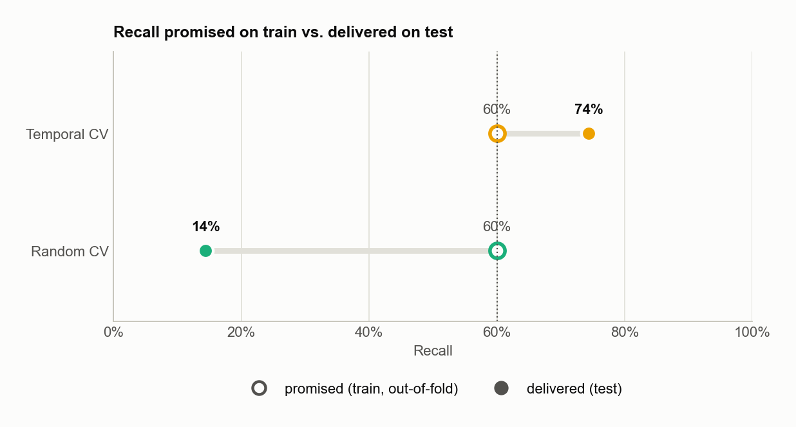

# olist-atraso — predicting late deliveries at purchase time

[](https://github.com/jedu28/olist-atraso/actions/workflows/ci.yml)

**English** · [Português](README.pt-BR.md)

A machine-learning model that flags, **at checkout**, which e-commerce orders are likely to arrive after the promised date, built on the public [Olist dataset](https://www.kaggle.com/datasets/olistbr/brazilian-ecommerce) (96k delivered orders, Brazil, 2016–2018).

The project's focus goes beyond the model. It is about **turning a score into a decision you can trust on future data**:
- every feature is *point-in-time*: it uses only what was known when the order was placed;
- every validation step respects time;
- the decision threshold is chosen explicitly, from a business rule.



## Results at a glance

Evaluated on the **most recent 20% of orders** (May 26 – Aug 29, 2018), which the model never saw:

| | Default cut (0.5) | **Chosen cut (0.23)** |
|---|---:|---:|
| Late orders caught (recall) | 7.1% | **74.3%** (759 of 1,021) |
| Precision among flagged orders | 11.8% | **9.5%** (1.8× the 5.3% base rate) |
| Orders flagged | 3.2% | **41.6%** |

Same model, same scores: only the cut changed. The business rule asks for at least 60% of late orders caught with the fewest false alarms, and the cut was picked on **temporal out-of-fold predictions of the training set**. The test set was never used to choose it.

## What I learned

1. **The 0.5 threshold is not neutral.** With ~8% late orders, few scores ever cross 0.5, so the "default" classifier misses 93% of delays even though its ranking is informative (ROC-AUC 0.72–0.76).
2. **Where you choose the threshold matters as much as how.** Both cuts in the chart above promised 60% recall on training data. The one chosen on random CV delivered **14%** on future months; the one chosen on time-ordered CV delivered **74%**.
3. **I found a leak in my own feature.** The seller's historical late rate counted orders that were still in transit at purchase time. Fixing it made the feature look weaker (ROC-AUC 0.616 → 0.564) and the model *better* on the test months (0.748 → 0.761).
4. **Hyperparameter tuning won the validation but lost the future.** Optuna improved temporal CV (0.603 → 0.642), yet the untuned model ranked better on the test months (0.761 vs 0.724). I report this rather than quietly swapping models after looking at the test set.

## Documentation

| | English | Português |
|---|---|---|
| Business: problem, decision, trade-offs, recommendations | [docs/en/business.md](docs/en/business.md) | [docs/pt-BR/negocio.md](docs/pt-BR/negocio.md) |
| Technical: data, features, validation, model, code | [docs/en/technical.md](docs/en/technical.md) | [docs/pt-BR/tecnico.md](docs/pt-BR/tecnico.md) |
| Notebooks (Portuguese) | [01 · exploration](notebooks/01_exploracao.ipynb) · [02 · modeling](notebooks/02_modelagem.ipynb) | |

## Quickstart

```bash
make setup      # .venv + pinned dependencies
# download the Olist CSVs from Kaggle into data/raw/
make train      # dataset -> model -> threshold (temporal OOF) -> data/processed/model.joblib
make evaluate   # re-evaluate the saved artifact on the test months
make figures    # regenerate every chart in docs/figures
make test lint  # unit tests + ruff
```

Run `make help` to list every command.

## Project structure

```
src/
  config.py       single source of truth: paths, constants, feature contract, hyperparameters
  data.py         raw CSV loading
  features.py     target + point-in-time feature engineering
  modeling.py     preprocessing, pipelines, temporal split, baselines
  thresholds.py   threshold rule + temporal out-of-fold predictions
  tuning.py       Optuna search (temporal CV)
  metrics.py      metrics at an operating point
  artifact.py     ModelArtifact: pipeline + threshold + metadata, saved together
  train.py        CLI: trains and saves the artifact
  evaluate.py     CLI: re-evaluates a saved artifact
  plotting.py     shared chart style (colorblind-safe palette)
scripts/make_figures.py   reproducible figures + docs/results.json
notebooks/                exploration and modeling narrative
tests/                    unit tests (leakage, threshold rule, OOF, artifact)
```

## Roadmap

- [x] Data, features and temporal baseline
- [x] XGBoost, business-driven threshold, reproducible artifact, CI (lint + tests)
- [ ] Temporal train/validation/test split to settle defaults vs. tuned parameters
- [ ] Probability calibration and a top-k-per-period alternative to a fixed cut
- [ ] FastAPI service, Docker, AWS Lambda deploy
- [ ] Monitoring: logs and drift (Evidently)
