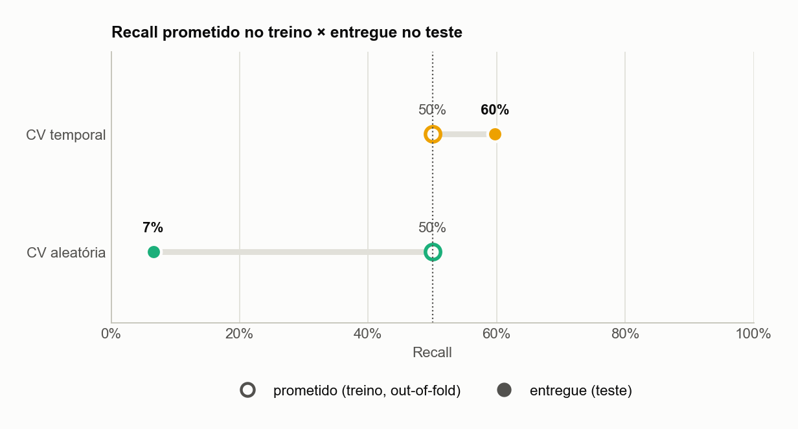

# olist-atraso — previsão de atraso de entrega na hora da compra

[English](README.md) · **Português**

Um modelo de machine learning que sinaliza, **no checkout**, quais pedidos de e-commerce têm risco de chegar depois da data prometida. Usa o [dataset público da Olist](https://www.kaggle.com/datasets/olistbr/brazilian-ecommerce) (96 mil pedidos entregues, Brasil, 2016–2018).

O foco do projeto vai além do modelo. É **transformar um score numa decisão confiável em dados futuros**:
- toda feature é *point-in-time*: usa só o que se sabia no momento da compra;
- toda validação respeita o tempo;
- o threshold de decisão é escolhido explicitamente, a partir de uma regra de negócio.



## Resultados

Avaliação nos **20% de pedidos mais recentes** (26/05 a 29/08/2018), que o modelo nunca viu:

| | Corte padrão (0.5) | **Corte escolhido (0.28)** |
|---|---:|---:|
| Atrasos encontrados (recall) | 7,1% | **59,7%** (610 de 1.021) |
| Precisão entre os sinalizados | 11,8% | **10,7%** (2,0× a taxa base de 5,3%) |
| Pedidos sinalizados | 3,2% | **29,7%** |

Mesmo modelo, mesmos scores: só o corte mudou. O corte foi escolhido em **previsões out-of-fold temporais do treino**. O teste nunca foi usado para escolhê-lo.

## O que aprendi

1. **O threshold de 0.5 não é neutro.** Com ~8% de atrasos, poucos scores passam de 0.5. O classificador "padrão" perde 93% dos atrasos, mesmo com um ranking informativo (ROC-AUC 0,72–0,76).
2. **Onde se escolhe o threshold importa tanto quanto como.** Os dois cortes do gráfico acima prometiam 50% de recall no treino. O escolhido em CV aleatória entregou **7%** nos meses futuros; o escolhido em CV temporal entregou **60%**.
3. **Encontrei um vazamento na minha própria feature.** A taxa de atraso histórica do vendedor contava pedidos ainda em trânsito na data da compra. Corrigida, a feature parece mais fraca (ROC-AUC 0,616 → 0,564) e o modelo fica *melhor* nos meses de teste (0,748 → 0,761).
4. **O tuning ganhou a validação e perdeu o futuro.** O Optuna melhorou a CV temporal (0,603 → 0,642), mas o modelo sem tuning ranqueou melhor nos meses de teste (0,761 contra 0,724). Eu documento isso em vez de trocar o modelo em silêncio depois de olhar o teste.

## Documentação

| | Português | English |
|---|---|---|
| Negócio: problema, decisão, trade-offs, recomendações | [docs/pt-BR/negocio.md](docs/pt-BR/negocio.md) | [docs/en/business.md](docs/en/business.md) |
| Técnica: dados, features, validação, modelo, código | [docs/pt-BR/tecnico.md](docs/pt-BR/tecnico.md) | [docs/en/technical.md](docs/en/technical.md) |
| Notebooks | [01 · exploração](notebooks/01_exploracao.ipynb) · [02 · modelagem](notebooks/02_modelagem.ipynb) | |

## Como rodar

```bash
make setup      # .venv + dependências fixadas
# baixe os CSVs da Olist no Kaggle para data/raw/
make train      # dataset -> modelo -> threshold (OOF temporal) -> data/processed/model.joblib
make evaluate   # reavalia o artefato salvo nos meses de teste
make figures    # regenera todos os gráficos de docs/figures
make test lint  # testes unitários + ruff
```

`make help` lista todos os comandos.

## Estrutura

```
src/
  config.py       fonte única de verdade: caminhos, constantes, contrato de features, hiperparâmetros
  data.py         leitura dos CSVs brutos
  features.py     alvo + features point-in-time
  modeling.py     pré-processamento, pipelines, split temporal, baselines
  thresholds.py   regra do threshold + previsões out-of-fold temporais
  tuning.py       busca do Optuna (CV temporal)
  metrics.py      métricas num ponto de operação
  artifact.py     ModelArtifact: pipeline + threshold + metadados, salvos juntos
  train.py        CLI: treina e salva o artefato
  evaluate.py     CLI: reavalia um artefato salvo
  plotting.py     estilo único dos gráficos (paleta segura para daltonismo)
scripts/make_figures.py   figuras reproduzíveis + docs/results.json
notebooks/                narrativa de exploração e modelagem
tests/                    testes unitários (vazamento, regra do threshold, OOF, artefato)
```

## Próximos passos

- [x] Dados, features e baseline temporal
- [x] XGBoost, threshold orientado a negócio, artefato reproduzível, CI (lint + testes)
- [ ] Split temporal treino/validação/teste para decidir entre parâmetros padrão e tunados
- [ ] Calibração das probabilidades e alternativa top-k por período ao corte fixo
- [ ] Serviço FastAPI, Docker, deploy na AWS Lambda
- [ ] Monitoramento: logs e drift (Evidently)
