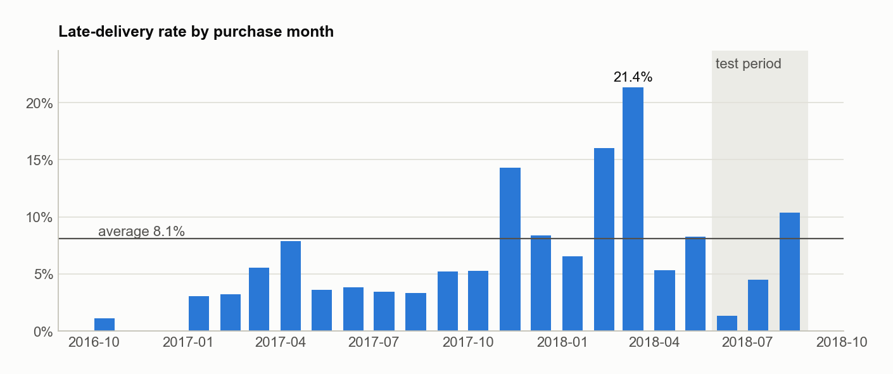
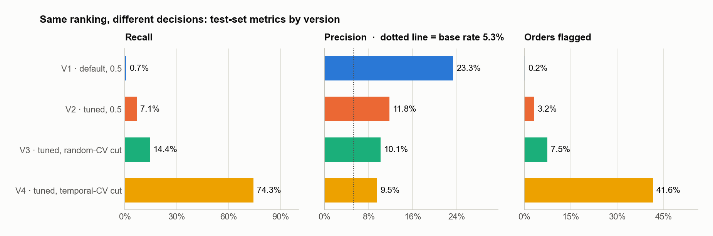
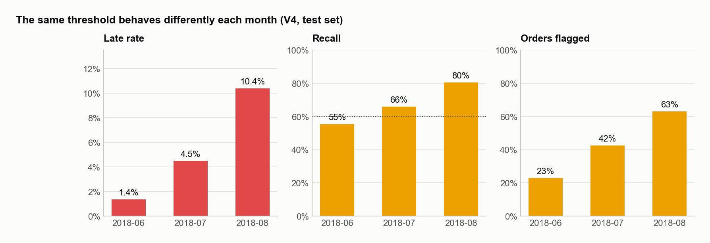

# Late-delivery risk at checkout — business overview

[← README](../../README.md) · [Technical documentation](technical.md) · [Versão em português](../pt-BR/negocio.md)

## Summary

- **The problem.** 8.1% of Olist's delivered orders arrived after the date promised at checkout. In some months it was more than one in five.
- **What we built.** A model that scores every order **at the moment of purchase**, using only information available then, and flags the ones most likely to arrive late.
- **What it delivers.** On three months of orders the model never saw, the chosen setting caught **74% of late orders** (759 of 1,021) by flagging 42% of orders. A flagged order is **1.8× more likely** to be late than an average one.
- **The key decision is the "alert threshold", not the algorithm.** With the textbook default setting, the same model caught only 7% of late orders.
- **Recommended use.** Low-cost, automated actions such as proactive customer messages, fulfilment priority and seller nudges. The alert volume changes month to month, so the threshold must be monitored.

## 1. Why late deliveries matter

A late delivery is a broken promise: the customer saw a date at checkout and the order missed it. The cost shows up as negative reviews, support tickets, refunds and customers who don't come back. Late deliveries are also **very uneven over time**:

The rate ranged from **1.4%** (June 2018) to **21.4%** (March 2018), with peaks around Black Friday 2017 and in February–March 2018. A tool that only works "on average" would be of little use. It has to hold up in both calm and turbulent months.

## 2. What the model looks at

At checkout the platform already knows a lot about the order's risk. The model combines five kinds of signals:

| Signal | Example | What the data showed |
|---|---|---|
| **Route** | distance seller → customer, cross-state shipping, customer state | 6.4% late under 100 km vs. 13.7% above 2,000 km; AL 24%, MA 20% vs. SP 5.9% |
| **Promised deadline** | days between purchase and promised date | tight promises (≤ 10 days) were late 14.7% of the time; 45+ days, 2.0% |
| **Seller track record** | the seller's late rate **on deliveries already completed** | 6.7% vs. ~10% between the most and least reliable sellers |
| **Marketplace conditions** | late rate over the last 7 and 30 days, demand surges | captures shocks such as strikes and peak seasons while they happen |
| **Calendar** | Black Friday week, days until Christmas, season | seasonal peaks stretch delivery times |

Nothing about the delivery itself (carrier events, actual delivery date) is used. The model only uses what a real system would know at checkout.

## 3. From a score to a decision: the threshold

The model does not answer "late / not late". It gives each order a **risk score**. Someone has to decide **from which score we act**. That cut-off is the threshold, and it is a **business decision**.

**The business rule we used:** *catch at least 60% of the late orders, with as few false alarms as possible.* Missing a delay is the expensive error; a false alarm (a reassuring message to a customer whose order was fine) is cheap.

| | Default cut (0.5) | **Chosen cut (0.23)** |
|---|---:|---:|
| Late orders caught | 7.1% | **74.3%** |
| Share of flagged orders that were actually late | 11.8% | **9.5%** |
| Orders flagged | 3.2% | **41.6%** |

**How to read the precision of 9.5%.** Among orders flagged by the model, about 1 in 10 was late, **1.8× the 5.3% base rate** of the period. That also means ~9.6 false alarms per late order caught, so the setting pays off when the action is cheap and automated. It would not pay off for manual, costly interventions.

## 4. A menu of operating points

The threshold can be moved to fit the team's capacity. Each row below was chosen with the same method (on historical data only) and then measured on the unseen months:

| Target on history | Late orders caught (test) | Orders flagged | Precision | False alarms per catch |
|---|---:|---:|---:|---:|
| 30% | 25.5% | 12.6% | 10.7% | 8.3 |
| 40% | 42.7% | 20.3% | 11.2% | 8.0 |
| 50% | 59.7% | 29.7% | 10.7% | 8.4 |
| **60% (chosen)** | **74.3%** | **41.6%** | **9.5%** | **9.6** |
| 70% | 88.3% | 56.5% | 8.3% | 11.1 |

**Takeaway:** the efficiency (about 8 false alarms per late order caught) is almost constant up to ~60% coverage, then gets worse. The chosen setting deliberately trades a little efficiency (9.6 instead of ~8) for coverage (74% instead of 60%), because a missed delay is the expensive error. If actions become costly, the 50% row is the natural fallback.

## 5. The same threshold behaves differently every month

With a fixed threshold, the model flagged **23% of orders in June and 63% in August**, because its scores rise when the operation is under stress. This is the desired behaviour (more risk means more alerts), but it matters for planning:

- If actions are **automated** (messages, priority flags), a fixed threshold is fine.
- If a **team with fixed capacity** handles the alerts, flag a fixed number of orders per period instead (the top-*k* by risk), and review the threshold monthly.

## 6. Why these numbers can be trusted

Three safeguards separate this project from a demo that only looks good on paper:

1. **Tested on the future, not on a random sample.** The model was trained on orders up to May 2018 and evaluated on June–August 2018, the way it would run in production.
2. **The threshold's promise was checked.** A threshold chosen with a common but flawed method promised 60% coverage and delivered **14%**. The time-aware method promised 60% and delivered **74%**.

   
3. **A data leak was found and fixed.** The seller's track record was counting orders still in transit at purchase time, which is information from the future. After the fix the model got *better* on the unseen months.

## 7. Limitations

- **Historical, public data (2016–2018).** Patterns may have changed. Before any real use, the model must be re-trained and re-validated on recent data.
- **The scores are rankings, not probabilities.** A score of 0.3 does not mean a 30% chance of delay. Calibration is on the roadmap.
- **Hyperparameter tuning did not pay off on future months.** The untuned model ranked slightly better on the test period. We report it openly; settling it requires a fresh evaluation window (see the technical documentation).
- **Missing operational signals.** Carrier, warehouse and stock data would likely improve the model substantially.

## 8. Recommendations

1. **Pilot with cheap, automated actions**, e.g. a proactive "your order may take a little longer" message for flagged orders, and measure the impact on reviews and support tickets against a control group.
2. **Choose the operating point with the operations team**, using the menu in section 4 and the real cost of each action.
3. **Monitor monthly**: share of orders flagged, coverage and precision, and re-train when the late-delivery pattern shifts.
4. **Add operational data** (carrier, fulfilment times) in the next iteration.
