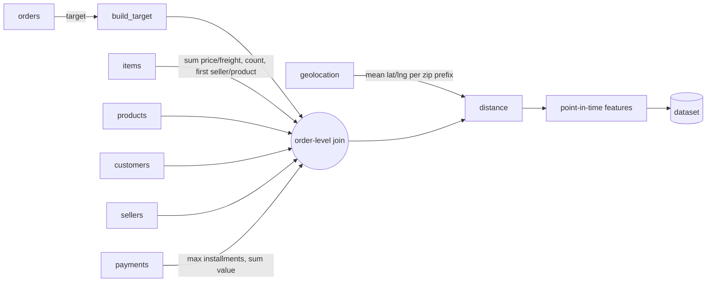
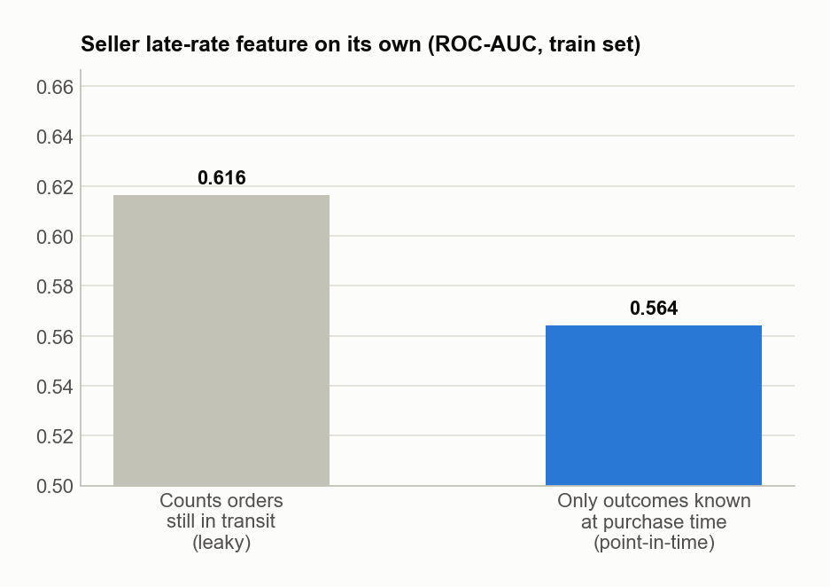
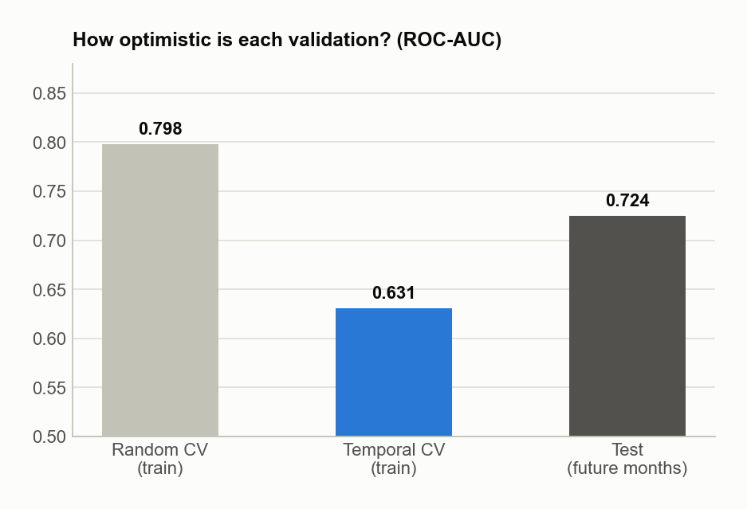
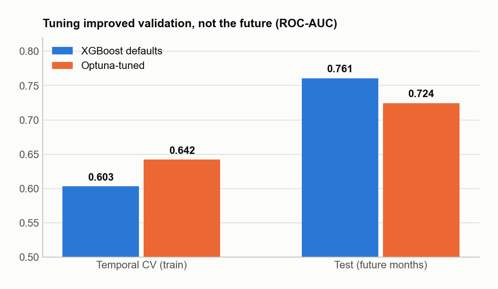
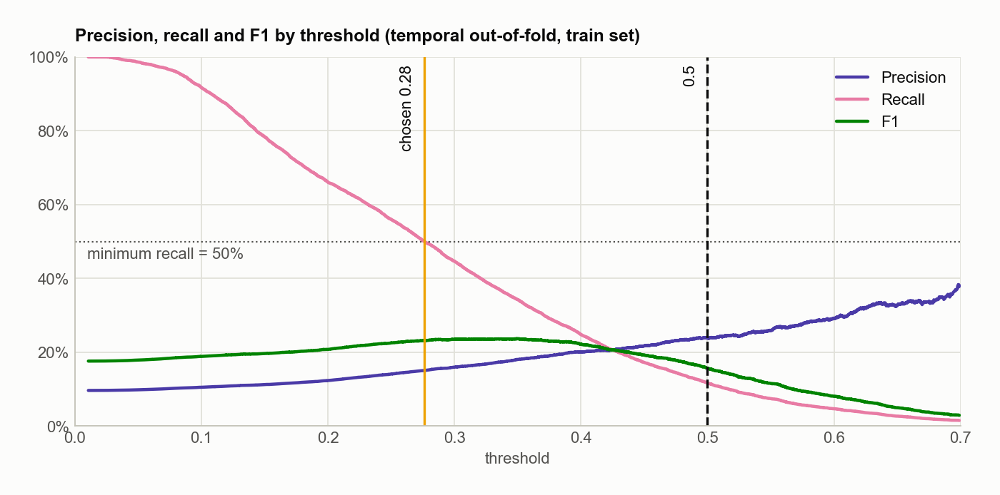
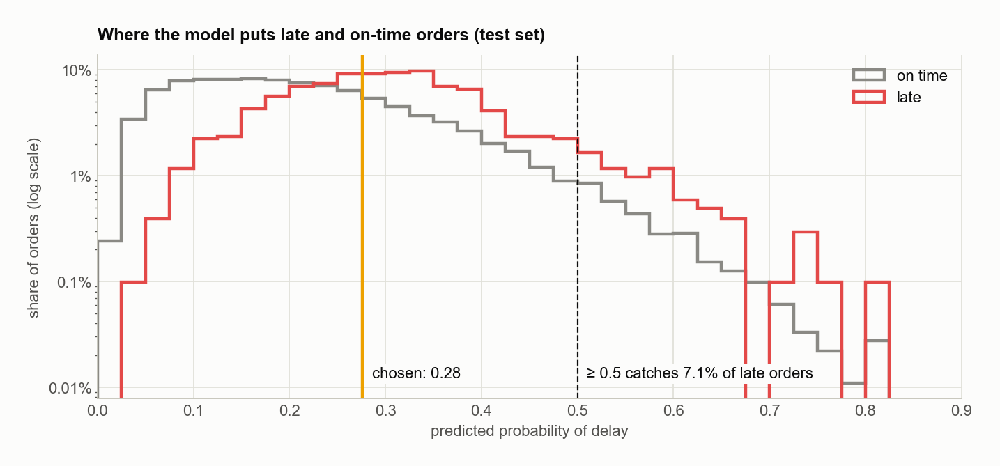
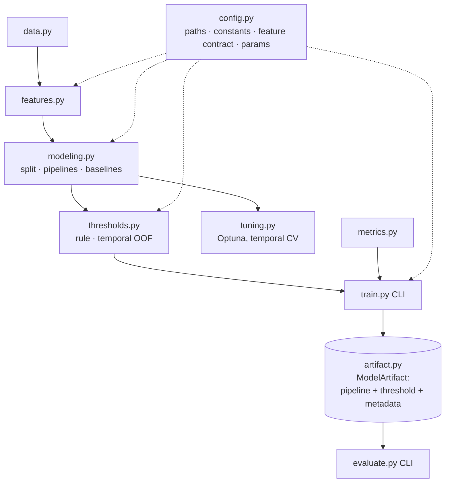

# Late-delivery risk at checkout — technical documentation

[← README](../../README.md) · [Business overview](business.md) · [Versão em português](../pt-BR/tecnico.md)

Every number in this document comes from `docs/results.json` and the executed notebooks, and all of them are regenerated by `make train` and `make figures`.

## 1. Problem framing

| | |
|---|---|
| **Unit** | one delivered order |
| **Target** (`atrasado`) | `1` if `order_delivered_customer_date > order_estimated_delivery_date` |
| **Prediction time** | purchase (`order_purchase_timestamp`); only information available then |
| **Population** | 96,476 delivered orders, 2016-09-15 → 2018-08-29 (cancelled / undelivered orders have no target and are dropped) |
| **Class balance** | 8.1% late overall; 8.8% in train, 5.3% in test |
| **Primary metrics** | ROC-AUC / PR-AUC for ranking; precision, recall and share flagged at an explicit operating point |

Accuracy is meaningless here: predicting "on time" for every test order scores 94.7%.

## 2. Data and joins

Seven tables of the Olist dataset are joined at order level (`src/features.py::build_dataset`):

Orders with several items take the **first item's seller and product** (a simplification: 1.3% of orders have more than one seller).

## 3. Features

Rule: **a feature may only use information that existed at purchase time.** Historical aggregates only count outcomes that were already known, meaning orders **already delivered** before the current purchase.

| Group | Features | Notes |
|---|---|---|
| Order | `preco_total`, `frete_total`, `n_itens`, `product_weight_g`, `payment_installments`, `payment_value_total`, `product_category_name` | |
| Promise | `prazo_prometido` | days between purchase and the estimated date shown at checkout; legitimate, since the estimate is known at purchase |
| Route | `distancia_km` (haversine between zip-prefix centroids), `estados_diferentes`, `customer_state`, `seller_state` | |
| Seller history | `seller_pedidos_anteriores`, `seller_taxa_atraso_historica` | only the seller's orders **delivered before** this purchase (`merge_asof` on delivery date, strictly before) |
| Marketplace climate | `clima_atraso_7d`, `clima_atraso_30d`, `clima_choque` (7d ÷ 30d), `pressao_demanda` | late rates over deliveries **completed** in the window; demand counts purchases, known in real time |
| Calendar | `dia_semana_compra`, `mes_compra`, `mes_sin`, `mes_cos`, `dias_para_natal`, `semana_black_friday` | cyclical month encoding keeps December next to January |

Preprocessing (`src/modeling.py`): median imputation + standard scaling for numeric features; most-frequent imputation + one-hot encoding (`handle_unknown="ignore"`) for categoricals, all inside the sklearn `Pipeline`, fitted on training folds only.

### 3.1 The leak that was fixed

The first version of the seller-history feature used a cumulative sum over orders **purchased** before the current one. But an order's outcome only exists once it is **delivered**. In 7.6% of (order, earlier order of the same seller) pairs, the earlier order was still in transit at purchase time. The feature was reading the future.

On its own, the leaky feature scored ROC-AUC 0.616 on the training period; the point-in-time version scores 0.564. After the fix, the default XGBoost **improved** on the test months (ROC-AUC 0.748 → 0.761): the leak inflated validation *and* hurt generalisation. A regression test (`tests/test_features.py::test_seller_history_ignores_orders_not_yet_delivered`) pins the behaviour.

## 4. Split and validation

**Hold-out.** Orders sorted by purchase time: the oldest 80% train (77,180 orders, up to 2018-05-26), the newest 20% test (19,296 orders, 2018-05-26 → 2018-08-29). The test set is touched once per model version, for reporting.

**Cross-validation inside train.** A shuffled `StratifiedKFold` surrounds each validation order with training orders from the same weeks. Climate and calendar features then act as a "which month is this" identifier, and the score is inflated:

| Validation (tuned XGBoost) | ROC-AUC |
|---|---:|
| Random 10-fold CV, pooled out-of-fold | 0.798 |
| `TimeSeriesSplit` (5 folds), pooled out-of-fold | 0.631 |
| Test (future months) | 0.724 |

Temporal CV is *pessimistic*: its early folds train on a fraction of the history. Random CV is *optimistic* because of leakage across time. Only the temporal bias exists in production, so **every model-selection step uses `TimeSeriesSplit`**.

## 5. Models

### 5.1 Baselines (same split, test set)

| Model | ROC-AUC | PR-AUC | Recall @ 0.5 |
|---|---:|---:|---:|
| Logistic regression (balanced) | 0.696 | 0.112 | 22.6% |
| Decision tree (depth 8, balanced) | 0.594 | 0.073 | 19.1% |
| KNN (k = 15) | 0.529 | 0.055 | 0.3% |
| **XGBoost, default params (V1)** | **0.761** | **0.149** | 0.7% |

### 5.2 Hyperparameter search

`src/tuning.py::tune_xgb`: Optuna TPE sampler (seed 42), 30 trials, objective = mean ROC-AUC over a 5-fold `TimeSeriesSplit` of the training set. The search space covers `n_estimators`, `max_depth`, `learning_rate`, `subsample`, `colsample_bytree`, `min_child_weight`, `reg_lambda` and `scale_pos_weight`. The best parameters are frozen in `src/config.py::XGB_TUNED_PARAMS` (depth 4, 276 trees, lr 0.046, `scale_pos_weight` 5.4).

**The search did not transfer to the future.** It improved temporal CV (0.603 → 0.642) but ranked worse on the test months (0.761 → 0.724). An earlier search that used random CV also landed below the defaults (0.742). The likely reason: the training period contains distinct regimes (the Feb–Mar 2018 crisis, Black Friday), and CV rewards parameters that fit them.

Switching to the default parameters now would mean choosing on the test set. The model kept in the artifact is therefore the one selected by the pre-defined procedure, and settling defaults vs. tuned needs a separate temporal validation window (roadmap).

## 6. Threshold selection

The model outputs a score; the decision needs a cut. The rule (`src/thresholds.py::choose_threshold`):

> Among all cuts whose recall is at least `MIN_RECALL` (0.5), take the **highest**, i.e. the most precise one.

The rule is applied to **temporal out-of-fold predictions of the training set** (`temporal_oof_proba`): each block of the training period is scored by a model trained only on the blocks before it. The first block has no past and is dropped.

Why not 0.5? With a rare class, few scores cross it, and `scale_pos_weight` shifts all scores by an amount that changes with every training run:

Why temporal OOF and not random OOF? Both "promise" 50% recall on the data they were chosen on. Only one keeps the promise on future months:

| | Random-CV OOF (V3) | **Temporal OOF (V4)** |
|---|---:|---:|
| Threshold | 0.504 | **0.276** |
| Recall promised (OOF) | 50.0% | 50.0% |
| Recall delivered (test) | 6.6% | **59.7%** |

The temporal OOF errs on the conservative side (its fold models see less history than the final model), which here is the side the business prefers.

## 7. Results on the test months

| Version | Model | Threshold | Precision | Recall | F1 | ROC-AUC | PR-AUC | Flagged | TP | FP | FN |
|---|---|---:|---:|---:|---:|---:|---:|---:|---:|---:|---:|
| V1 | XGBoost default | 0.500 | 23.3% | 0.7% | 0.013 | 0.761 | 0.149 | 0.2% | 7 | 23 | 1,014 |
| V2 | XGBoost tuned | 0.500 | 11.8% | 7.1% | 0.088 | 0.724 | 0.103 | 3.2% | 72 | 540 | 949 |
| V3 | tuned + random-OOF cut | 0.504 | 11.6% | 6.6% | 0.084 | 0.724 | 0.103 | 3.0% | 67 | 512 | 954 |
| **V4** | **tuned + temporal-OOF cut** | **0.276** | **10.7%** | **59.7%** | **0.181** | 0.724 | 0.103 | **29.7%** | **610** | 5,114 | 411 |

V2–V4 share the ranking (same ROC-AUC/PR-AUC) and differ only in the operating point. The test base rate is 5.3%, so V4's precision is 2.0× the base rate.

**Monthly stability of V4** (fixed threshold):

| Month | Late rate | Flagged | Recall | Precision |
|---|---:|---:|---:|---:|
| 2018-06 | 1.4% | 15.0% | 42.2% | 3.8% |
| 2018-07 | 4.5% | 30.7% | 58.3% | 8.5% |
| 2018-08 | 10.4% | 46.0% | 62.7% | 14.2% |

Scores track operational stress, so alert volume varies threefold. For fixed-capacity teams, a top-*k*-per-period policy is the natural alternative.

## 8. Code architecture

Design decisions:

- **Single source of truth.** Paths, the feature contract, `MIN_RECALL`, the random seed and hyperparameters live in `src/config.py`. The feature list and model path used to be duplicated across training, evaluation and notebooks.
- **The threshold ships with the model.** `ModelArtifact` bundles the fitted pipeline, the threshold, the feature list and metadata (training/test periods, parameters, OOF and test metrics). `predict()` applies the stored threshold, so the pipeline can't be served with the wrong cut.
- **Thin CLIs.** `python -m src.train`, `python -m src.evaluate` and `python -m src.tuning` wrap library functions that the notebooks import as well. Notebooks narrate; they do not own logic.
- **Reproducible figures.** `scripts/make_figures.py` recomputes every chart in both languages and writes `docs/results.json`, so the text in the docs can be checked against it.

## 9. Reproducibility, tests and CI

- Pinned dependencies (`requirements.txt`, `requirements-dev.txt`), fixed seeds (`RANDOM_STATE = 42`, Optuna sampler seed).
- `make train` reproduces the V4 artifact; the modeling notebook re-runs the Optuna search and checks that its best parameters equal the frozen ones.
- Unit tests (`make test`): target definition, point-in-time seller history (including the leak regression), calendar encoding, haversine, threshold rule (minimum recall, highest cut, fallback), temporal OOF uses only the past, temporal split ordering, confusion-matrix bookkeeping, artifact round-trip.
- GitHub Actions runs `ruff check` and `pytest` on every push and pull request.

## 10. Limitations and next steps

1. **Settle tuned vs. default parameters** on a train / validation / test temporal split (or a new data window). The current test set has already been seen.
2. **Calibrate probabilities** (`CalibratedClassifierCV`, isotonic, on temporal folds) so scores read as chances.
3. **Top-*k* per period** as an alternative operating policy for fixed-capacity teams.
4. **Richer signals**: all sellers of multi-seller orders, carrier and fulfilment timestamps, product dimensions.
5. **Serving and monitoring**: FastAPI + Docker + AWS Lambda, then drift monitoring (Evidently) on features, score distribution and share flagged.
