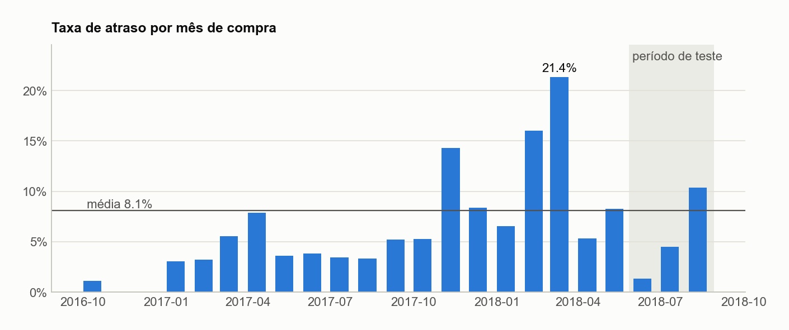
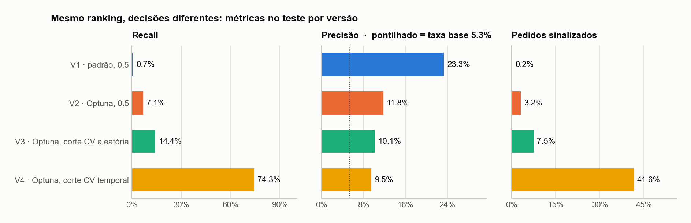
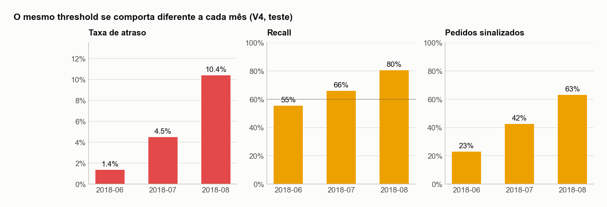

# Risco de atraso na hora da compra — visão de negócio

[← README](../../README.pt-BR.md) · [Documentação técnica](tecnico.md) · [English version](../en/business.md)

## Resumo

- **O problema.** 8,1% dos pedidos entregues pela Olist chegaram depois da data prometida no checkout. Em alguns meses foi mais de um em cada cinco.
- **O que foi construído.** Um modelo que dá uma nota de risco a cada pedido **no momento da compra**, usando só a informação disponível naquele instante, e sinaliza os que têm mais chance de atrasar.
- **O que ele entrega.** Em três meses de pedidos que o modelo nunca viu, a configuração escolhida encontrou **74% dos atrasos** (759 de 1.021) sinalizando 42% dos pedidos. Um pedido sinalizado tem **1,8× mais chance** de atrasar que um pedido qualquer.
- **A decisão principal é o "ponto de corte" do alerta, não o algoritmo.** Com a configuração padrão de livro-texto, o mesmo modelo encontrava só 7% dos atrasos.
- **Uso recomendado.** Ações automáticas e baratas, como aviso proativo ao cliente, prioridade na expedição e alerta ao vendedor. O volume de alertas varia de um mês para outro, então o corte precisa ser monitorado.

## 1. Por que o atraso importa

Um atraso é uma promessa quebrada: o cliente viu uma data no checkout e o pedido não chegou nela. O custo aparece em avaliações negativas, chamados no atendimento, reembolsos e clientes que não voltam. E o atraso é **muito irregular no tempo**:

A taxa foi de **1,4%** (junho/2018) a **21,4%** (março/2018), com picos na Black Friday de 2017 e em fevereiro–março de 2018. Uma ferramenta que só funciona "na média" teria pouca utilidade. Ela precisa se sustentar tanto em meses calmos quanto em meses turbulentos.

## 2. O que o modelo olha

No checkout, a plataforma já sabe muito sobre o risco do pedido. O modelo combina cinco tipos de sinal:

| Sinal | Exemplo | O que os dados mostraram |
|---|---|---|
| **Rota** | distância vendedor → cliente, envio interestadual, estado do cliente | 6,4% de atraso até 100 km contra 13,7% acima de 2.000 km; AL 24%, MA 20% contra SP 5,9% |
| **Prazo prometido** | dias entre a compra e a data prometida | prazos apertados (≤ 10 dias) atrasaram 14,7%; acima de 45 dias, 2,0% |
| **Histórico do vendedor** | taxa de atraso do vendedor **nas entregas já concluídas** | 6,7% contra ~10% entre os vendedores mais e menos confiáveis |
| **Clima do marketplace** | taxa de atraso dos últimos 7 e 30 dias, surtos de demanda | capta choques como greves e picos sazonais enquanto acontecem |
| **Calendário** | semana da Black Friday, dias até o Natal, sazonalidade | picos sazonais esticam os prazos |

Nada sobre a entrega em si (eventos da transportadora, data real de entrega) é usado. O modelo só usa o que um sistema real saberia no checkout.

## 3. De uma nota para uma decisão: o ponto de corte

O modelo não responde "atrasa / não atrasa". Ele dá uma **nota de risco** a cada pedido. Alguém precisa decidir **a partir de qual nota agir**. Esse valor é o ponto de corte (threshold), e ele é uma **decisão de negócio**.

**A regra de negócio usada:** *encontrar pelo menos 60% dos atrasos, com o mínimo possível de alarmes falsos.* Deixar passar um atraso é o erro caro; um alarme falso (um aviso tranquilizador para um cliente cujo pedido chegaria bem) é o barato.

| | Corte padrão (0.5) | **Corte escolhido (0.23)** |
|---|---:|---:|
| Atrasos encontrados | 7,1% | **74,3%** |
| Pedidos sinalizados que de fato atrasaram | 11,8% | **9,5%** |
| Pedidos sinalizados | 3,2% | **41,6%** |

**Como ler a precisão de 9,5%.** Entre os pedidos sinalizados, cerca de 1 em cada 10 atrasou, **1,8× a taxa base** de 5,3% do período. Isso também significa ~9,6 alarmes falsos por atraso encontrado, então a configuração compensa quando a ação é barata e automática. Não compensaria para intervenções manuais e caras.

## 4. Um cardápio de pontos de operação

O corte pode ser ajustado à capacidade da equipe. Cada linha abaixo foi escolhida com o mesmo método (só com dados históricos) e depois medida nos meses que o modelo nunca viu:

| Meta no histórico | Atrasos encontrados (teste) | Pedidos sinalizados | Precisão | Alarmes falsos por acerto |
|---|---:|---:|---:|---:|
| 30% | 25,5% | 12,6% | 10,7% | 8,3 |
| 40% | 42,7% | 20,3% | 11,2% | 8,0 |
| 50% | 59,7% | 29,7% | 10,7% | 8,4 |
| **60% (escolhido)** | **74,3%** | **41,6%** | **9,5%** | **9,6** |
| 70% | 88,3% | 56,5% | 8,3% | 11,1 |

**Conclusão:** a eficiência (cerca de 8 alarmes falsos por atraso encontrado) é quase constante até ~60% de cobertura e piora depois disso. A configuração escolhida troca de propósito um pouco de eficiência (9,6 em vez de ~8) por cobertura (74% em vez de 60%), porque deixar passar um atraso é o erro caro. Se as ações ficarem caras, a linha de 50% é o recuo natural.

## 5. O mesmo corte se comporta diferente a cada mês

Com um corte fixo, o modelo sinalizou **23% dos pedidos em junho e 63% em agosto**, porque as notas sobem quando a operação está sob estresse. É o comportamento desejado (mais risco gera mais alertas), mas afeta o planejamento:

- Se as ações são **automáticas** (mensagens, marcação de prioridade), um corte fixo funciona.
- Se uma **equipe com capacidade fixa** trata os alertas, é melhor sinalizar um número fixo de pedidos por período (os top-*k* por risco) e revisar o corte todo mês.

## 6. Por que dá para confiar nesses números

Três cuidados separam este projeto de uma demonstração que só funciona no papel:

1. **Testado no futuro, não numa amostra aleatória.** O modelo foi treinado com pedidos até maio/2018 e avaliado em junho–agosto/2018, como funcionaria em produção.
2. **A promessa do corte foi verificada.** Um corte escolhido com um método comum, mas falho, prometia 60% de cobertura e entregou **14%**. O método que respeita o tempo prometeu 60% e entregou **74%**.

   
3. **Um vazamento de dados foi encontrado e corrigido.** O histórico do vendedor contava pedidos ainda em trânsito na data da compra, ou seja, informação do futuro. Depois da correção, o modelo ficou *melhor* nos meses que nunca viu.

## 7. Limitações

- **Dados históricos e públicos (2016–2018).** Os padrões podem ter mudado. Antes de qualquer uso real, o modelo precisa ser retreinado e revalidado com dados recentes.
- **As notas ordenam risco, não são probabilidades.** Uma nota de 0,3 não significa 30% de chance de atraso. A calibração está nos próximos passos.
- **O ajuste fino de hiperparâmetros não compensou nos meses futuros.** O modelo sem ajuste ranqueou um pouco melhor no período de teste. Isso está documentado abertamente; decidir entre os dois exige uma janela de avaliação nova (ver a documentação técnica).
- **Faltam sinais operacionais.** Dados de transportadora, armazém e estoque provavelmente melhorariam bastante o modelo.

## 8. Recomendações

1. **Piloto com ações baratas e automáticas**, por exemplo uma mensagem proativa ("seu pedido pode demorar um pouco mais") para os pedidos sinalizados, medindo o impacto em avaliações e chamados contra um grupo de controle.
2. **Escolher o ponto de operação com a equipe de operações**, usando o cardápio da seção 4 e o custo real de cada ação.
3. **Monitorar todo mês**: fração de pedidos sinalizados, cobertura e precisão, e retreinar quando o padrão de atraso mudar.
4. **Incluir dados operacionais** (transportadora, tempos de expedição) na próxima iteração.
