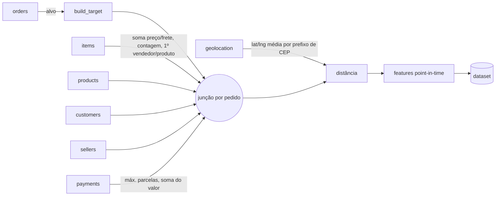
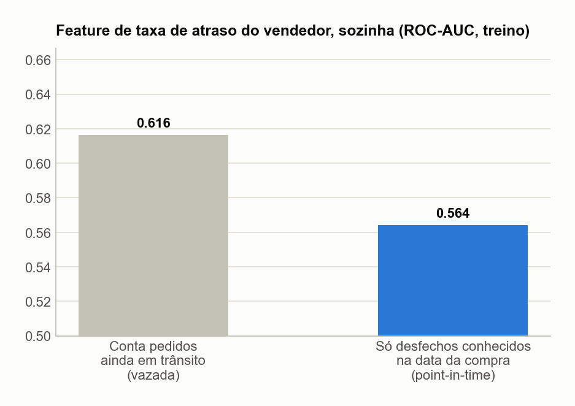
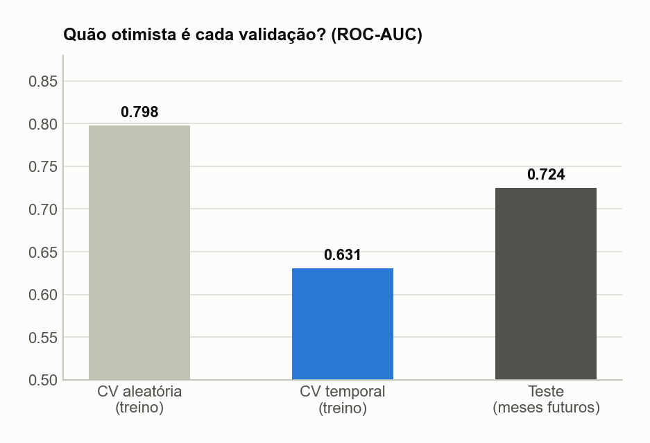
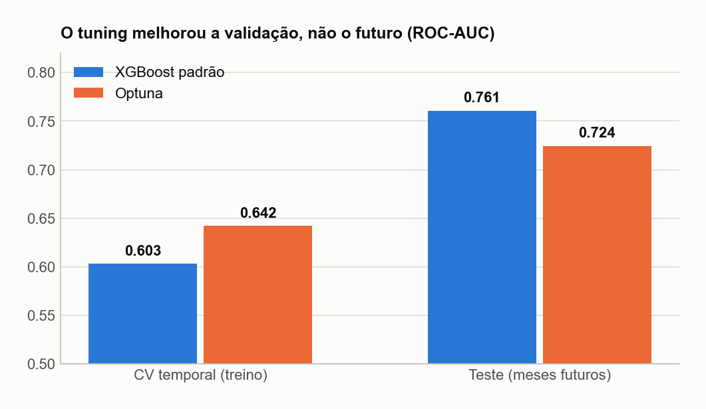
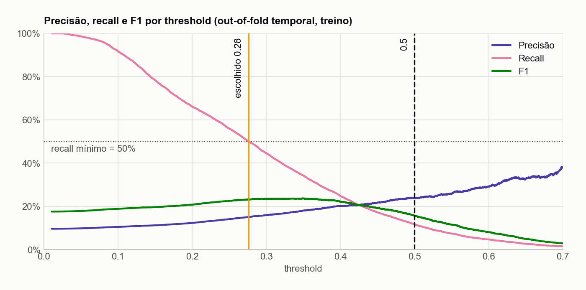
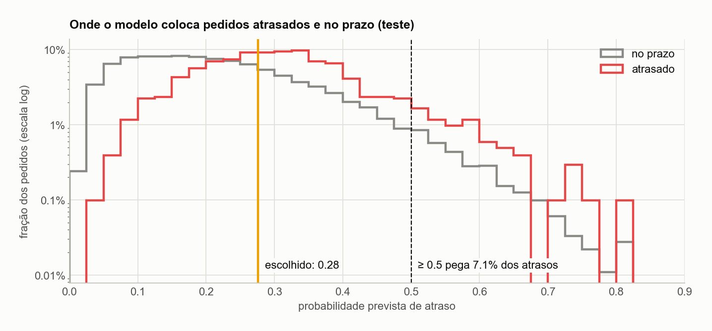
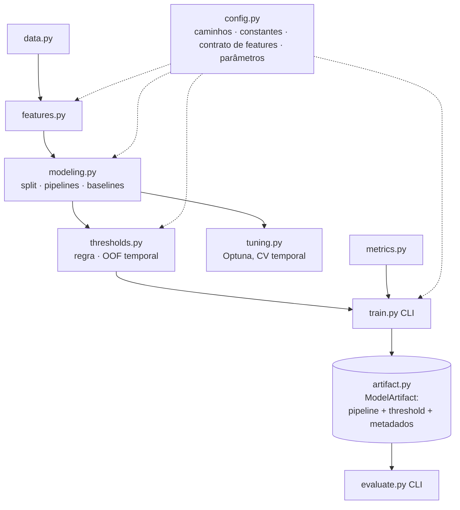

# Risco de atraso na hora da compra — documentação técnica

[← README](../../README.pt-BR.md) · [Visão de negócio](negocio.md) · [English version](../en/technical.md)

Todos os números deste documento vêm de `docs/results.json` e dos notebooks executados, e são regenerados por `make train` e `make figures`.

## 1. Formulação do problema

| | |
|---|---|
| **Unidade** | um pedido entregue |
| **Alvo** (`atrasado`) | `1` se `order_delivered_customer_date > order_estimated_delivery_date` |
| **Momento da previsão** | a compra (`order_purchase_timestamp`); só informação disponível naquele instante |
| **População** | 96.476 pedidos entregues, 15/09/2016 → 29/08/2018 (pedidos cancelados ou não entregues não têm alvo e são descartados) |
| **Balanceamento** | 8,1% de atraso no total; 8,8% no treino, 5,3% no teste |
| **Métricas principais** | ROC-AUC / PR-AUC para o ranking; precisão, recall e fração sinalizada num ponto de operação explícito |

Acurácia não diz nada aqui: responder "no prazo" para todo pedido do teste dá 94,7%.

## 2. Dados e junções

Sete tabelas do dataset da Olist são unidas no nível do pedido (`src/features.py::build_dataset`):

Pedidos com vários itens usam **o vendedor e o produto do primeiro item** (simplificação: 1,3% dos pedidos têm mais de um vendedor).

## 3. Features

Regra: **uma feature só pode usar informação que existia na data da compra.** Agregados históricos só contam desfechos já conhecidos, ou seja, pedidos **já entregues** antes da compra atual.

| Grupo | Features | Observações |
|---|---|---|
| Pedido | `preco_total`, `frete_total`, `n_itens`, `product_weight_g`, `payment_installments`, `payment_value_total`, `product_category_name` | |
| Promessa | `prazo_prometido` | dias entre a compra e a data estimada mostrada no checkout; legítima, porque a estimativa é conhecida na compra |
| Rota | `distancia_km` (haversine entre centroides de prefixo de CEP), `estados_diferentes`, `customer_state`, `seller_state` | |
| Histórico do vendedor | `seller_pedidos_anteriores`, `seller_taxa_atraso_historica` | só pedidos do vendedor **entregues antes** desta compra (`merge_asof` na data de entrega, estritamente antes) |
| Clima do marketplace | `clima_atraso_7d`, `clima_atraso_30d`, `clima_choque` (7d ÷ 30d), `pressao_demanda` | taxas de atraso sobre entregas **concluídas** na janela; a demanda conta compras, conhecidas em tempo real |
| Calendário | `dia_semana_compra`, `mes_compra`, `mes_sin`, `mes_cos`, `dias_para_natal`, `semana_black_friday` | a codificação cíclica do mês mantém dezembro vizinho de janeiro |

Pré-processamento (`src/modeling.py`): imputação pela mediana + padronização nas numéricas; imputação pela moda + one-hot (`handle_unknown="ignore"`) nas categóricas, tudo dentro do `Pipeline` do sklearn, ajustado só nos folds de treino.

### 3.1 O vazamento corrigido

A primeira versão do histórico do vendedor usava uma soma acumulada sobre os pedidos **comprados** antes do atual. Mas o desfecho de um pedido só existe quando ele é **entregue**. Em 7,6% dos pares (pedido, pedido anterior do mesmo vendedor), o anterior ainda estava em trânsito na data da compra. A feature lia o futuro.

Sozinha, a feature vazada tinha ROC-AUC de 0,616 no período de treino; a versão point-in-time tem 0,564. Depois da correção, o XGBoost padrão **melhorou** nos meses de teste (ROC-AUC 0,748 → 0,761): o vazamento inflava a validação *e* piorava a generalização. Um teste de regressão (`tests/test_features.py::test_seller_history_ignores_orders_not_yet_delivered`) garante o comportamento.

## 4. Split e validação

**Hold-out.** Pedidos ordenados pela data da compra: os 80% mais antigos são treino (77.180 pedidos, até 26/05/2018) e os 20% mais recentes, teste (19.296 pedidos, 26/05 → 29/08/2018). O teste é usado uma vez por versão do modelo, só para reportar.

**Validação cruzada dentro do treino.** Uma `StratifiedKFold` embaralhada cerca cada pedido de validação com pedidos de treino das mesmas semanas. As features de clima e calendário viram um identificador de "que mês é este", e a métrica infla:

| Validação (XGBoost tunado) | ROC-AUC |
|---|---:|
| CV aleatória de 10 folds, out-of-fold agregado | 0,798 |
| `TimeSeriesSplit` (5 folds), out-of-fold agregado | 0,631 |
| Teste (meses futuros) | 0,724 |

A CV temporal é *pessimista*: seus primeiros folds treinam com uma fração do histórico. A aleatória é *otimista* por vazamento no tempo. Só o viés temporal existe em produção, então **toda etapa de seleção de modelo usa `TimeSeriesSplit`**.

## 5. Modelos

### 5.1 Baselines (mesmo split, conjunto de teste)

| Modelo | ROC-AUC | PR-AUC | Recall @ 0.5 |
|---|---:|---:|---:|
| Regressão logística (balanceada) | 0,696 | 0,112 | 22,6% |
| Árvore de decisão (profundidade 8, balanceada) | 0,594 | 0,073 | 19,1% |
| KNN (k = 15) | 0,529 | 0,055 | 0,3% |
| **XGBoost, parâmetros padrão (V1)** | **0,761** | **0,149** | 0,7% |

### 5.2 Busca de hiperparâmetros

`src/tuning.py::tune_xgb`: sampler TPE do Optuna (semente 42), 30 trials, objetivo = ROC-AUC médio numa `TimeSeriesSplit` de 5 folds do treino. O espaço de busca cobre `n_estimators`, `max_depth`, `learning_rate`, `subsample`, `colsample_bytree`, `min_child_weight`, `reg_lambda` e `scale_pos_weight`. Os melhores parâmetros ficam congelados em `src/config.py::XGB_TUNED_PARAMS` (profundidade 4, 276 árvores, lr 0,046, `scale_pos_weight` 5,4).

**A busca não se transferiu para o futuro.** Ela melhorou a CV temporal (0,603 → 0,642), mas ranqueou pior nos meses de teste (0,761 → 0,724). Uma busca anterior, com CV aleatória, também ficou abaixo do padrão (0,742). A explicação provável: o período de treino tem regimes distintos (a crise de fev–mar/2018, a Black Friday), e a CV premia parâmetros ajustados a eles.

Trocar agora para os parâmetros padrão seria escolher olhando o teste. Por isso o modelo no artefato é o selecionado pelo procedimento definido antes, e decidir entre padrão e tunado exige uma janela de validação temporal separada (próximos passos).

## 6. Escolha do threshold

O modelo devolve uma nota; a decisão precisa de um corte. A regra (`src/thresholds.py::choose_threshold`):

> Entre todos os cortes com recall de pelo menos `MIN_RECALL` (0,5), usar o **mais alto**, ou seja, o mais preciso.

A regra é aplicada às **previsões out-of-fold temporais do treino** (`temporal_oof_proba`): cada bloco do período de treino recebe a nota de um modelo treinado só com os blocos anteriores. O primeiro bloco não tem passado e é descartado.

Por que não 0,5? Com classe rara, poucos scores passam dele, e o `scale_pos_weight` desloca todos os scores numa quantidade que muda a cada treino:

Por que OOF temporal e não aleatório? Os dois "prometem" 50% de recall nos dados em que foram escolhidos. Só um cumpre a promessa nos meses futuros:

| | OOF de CV aleatória (V3) | **OOF temporal (V4)** |
|---|---:|---:|
| Threshold | 0,504 | **0,276** |
| Recall prometido (OOF) | 50,0% | 50,0% |
| Recall entregue (teste) | 6,6% | **59,7%** |

O OOF temporal erra para o lado conservador (os modelos dos folds veem menos histórico que o modelo final), que aqui é o lado que o negócio prefere.

## 7. Resultados nos meses de teste

| Versão | Modelo | Threshold | Precisão | Recall | F1 | ROC-AUC | PR-AUC | Sinalizados | VP | FP | FN |
|---|---|---:|---:|---:|---:|---:|---:|---:|---:|---:|---:|
| V1 | XGBoost padrão | 0,500 | 23,3% | 0,7% | 0,013 | 0,761 | 0,149 | 0,2% | 7 | 23 | 1.014 |
| V2 | XGBoost tunado | 0,500 | 11,8% | 7,1% | 0,088 | 0,724 | 0,103 | 3,2% | 72 | 540 | 949 |
| V3 | tunado + corte OOF aleatório | 0,504 | 11,6% | 6,6% | 0,084 | 0,724 | 0,103 | 3,0% | 67 | 512 | 954 |
| **V4** | **tunado + corte OOF temporal** | **0,276** | **10,7%** | **59,7%** | **0,181** | 0,724 | 0,103 | **29,7%** | **610** | 5.114 | 411 |

V2 a V4 compartilham o ranking (mesmos ROC-AUC/PR-AUC) e diferem só no ponto de operação. A taxa base do teste é 5,3%, então a precisão da V4 é 2,0× a taxa base.

**Estabilidade mensal da V4** (corte fixo):

| Mês | Taxa de atraso | Sinalizados | Recall | Precisão |
|---|---:|---:|---:|---:|
| 2018-06 | 1,4% | 15,0% | 42,2% | 3,8% |
| 2018-07 | 4,5% | 30,7% | 58,3% | 8,5% |
| 2018-08 | 10,4% | 46,0% | 62,7% | 14,2% |

Os scores acompanham o estresse da operação, então o volume de alertas triplica entre os meses. Para equipes com capacidade fixa, sinalizar os top-*k* por período é a alternativa natural.

## 8. Arquitetura do código

Decisões de design:

- **Fonte única de verdade.** Caminhos, contrato de features, `MIN_RECALL`, semente e hiperparâmetros ficam em `src/config.py`. Antes, a lista de features e o caminho do modelo estavam duplicados entre treino, avaliação e notebooks.
- **O threshold viaja com o modelo.** O `ModelArtifact` junta o pipeline treinado, o threshold, a lista de features e metadados (períodos de treino/teste, parâmetros, métricas OOF e de teste). O `predict()` aplica o threshold salvo, então não há como servir o pipeline com o corte errado.
- **CLIs finas.** `python -m src.train`, `python -m src.evaluate` e `python -m src.tuning` envolvem funções de biblioteca que os notebooks também importam. Os notebooks narram; a lógica não mora neles.
- **Figuras reproduzíveis.** `scripts/make_figures.py` recalcula todos os gráficos nos dois idiomas e grava `docs/results.json`, então o texto da documentação pode ser conferido contra ele.

## 9. Reprodutibilidade, testes e CI

- Dependências fixadas (`requirements.txt`, `requirements-dev.txt`) e sementes fixas (`RANDOM_STATE = 42`, semente do sampler do Optuna).
- `make train` reproduz o artefato da V4; o notebook de modelagem refaz a busca do Optuna e confere que os melhores parâmetros são iguais aos congelados.
- Testes unitários (`make test`): definição do alvo, histórico point-in-time do vendedor (incluindo a regressão do vazamento), codificação de calendário, haversine, regra do threshold (recall mínimo, corte mais alto, fallback), OOF temporal usa só o passado, ordenação do split temporal, contabilidade da matriz de confusão e ida e volta do artefato.
- O GitHub Actions roda `ruff check` e `pytest` em todo push e pull request.

## 10. Limitações e próximos passos

1. **Decidir entre parâmetros tunados e padrão** num split temporal treino/validação/teste (ou numa janela de dados nova). O teste atual já foi visto.
2. **Calibrar as probabilidades** (`CalibratedClassifierCV`, isotônica, em folds temporais) para os scores serem lidos como chance.
3. **Top-*k* por período** como política de operação alternativa para equipes com capacidade fixa.
4. **Sinais mais ricos**: todos os vendedores de pedidos com vários vendedores, eventos de transportadora e expedição, dimensões do produto.
5. **Servir e monitorar**: FastAPI + Docker + AWS Lambda, depois monitoramento de drift (Evidently) nas features, na distribuição dos scores e na fração sinalizada.
